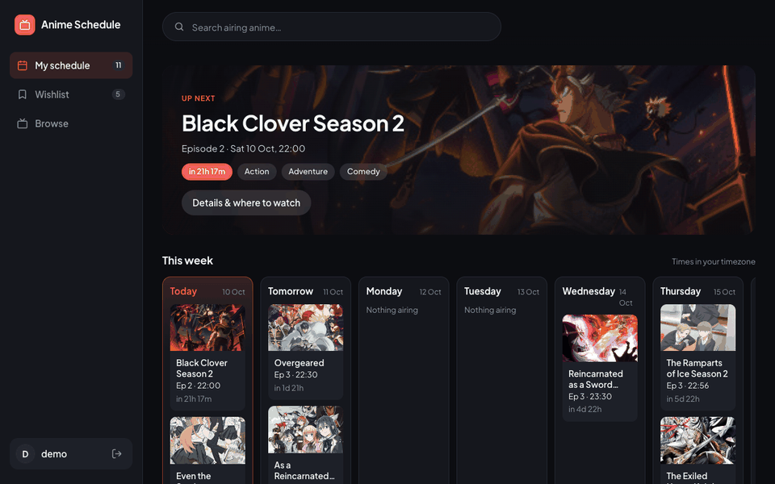

# AnimeWebAppApi

Backend for [AnimeWebApp](https://github.com/joshrkhoo/AnimeWebApp): user accounts, each user's schedule and wishlist, and a proxy to the [AniList](https://anilist.co) GraphQL API for show data and streaming links.

**Live API:** https://anime-web-app-api-production.up.railway.app · **App:** https://anime.joshrkhoo.com



*The [frontend](https://github.com/joshrkhoo/AnimeWebApp) running on this API.*

## Tech stack

| Layer           | What it uses                                                                                                                                   |
| --------------- | ---------------------------------------------------------------------------------------------------------------------------------------------- |
| Language        | Python 3.11                                                                                                                                    |
| Web framework   | [Flask](https://flask.palletsprojects.com) 3.1 (on Werkzeug 3.1), with [Flask-CORS](https://flask-cors.readthedocs.io) 6.0 restricting origins |
| App server      | [gunicorn](https://gunicorn.org) 23 with 2 sync workers (see `Procfile`)                                                                         |
| Database        | [MongoDB Atlas](https://www.mongodb.com/atlas) through [PyMongo](https://pymongo.readthedocs.io) 4.11                                            |
| Auth            | Werkzeug's scrypt password hashing; session tokens from Python's `secrets`, stored as SHA-256 hashes; a MongoDB TTL index expires old sessions |
| Show data       | [AniList GraphQL API](https://docs.anilist.co), called with [requests](https://requests.readthedocs.io) 2.32                                      |
| Caching         | In-process dictionaries with expiry times (no Redis)                                                                                           |
| Config          | Environment variables; [python-dotenv](https://pypi.org/project/python-dotenv/) loads `.env` in local development                                |
| Hosting         | [Railway](https://railway.com), built from `requirements.txt` and started from the `Procfile`                                                   |

## How it works

- **Accounts.** Passwords are stored only as scrypt hashes (via Werkzeug). Logging in creates a session: the client gets a random token and sends it as `Authorization: Bearer <token>`. The database stores only the token's SHA-256 hash, so a database leak doesn't expose usable sessions. Sessions last 30 days and are deleted on logout; MongoDB removes expired ones automatically.
- **Library.** For each saved show the database stores only `(userId, animeId, list)`, where `list` is `schedule` or `wishlist`. Titles, posters and air times are fetched live from AniList on every load, so they never go stale.
- **Wishlist promotion.** When a library loads, any wishlisted show that has started airing, or premieres within 7 days, moves to the schedule and is returned in `promoted`. Shows that have finished or been cancelled are removed.
- **Show details.** `/anime/<id>` adds the synopsis (HTML and `~!spoilers!~` stripped), studios, season, source, a trailer URL and streaming links (AniList external links of type `STREAMING`, de-duplicated by URL).
- **Caching.** AniList responses are cached in memory per process: 5 minutes per show, 15 minutes for browse lists and 30 minutes for details.

### MongoDB collections (database `anime_db`)

| Collection  | Contents                                                       |
| ----------- | -------------------------------------------------------------- |
| `users`     | `username` (unique, lowercase), `passwordHash`, `createdAt`    |
| `sessions`  | `tokenHash`, `userId`, `createdAt`, `expiresAt` (TTL index)    |
| `schedules` | `userId`, `animeId`, `list`, `addedAt` (unique per user + show) |

`animes` is left over from the pre-accounts version and is no longer used.

## Endpoints

All endpoints except register, login, logout and health require a bearer token.

| Method   | Path                  | Description                                                     |
| -------- | --------------------- | --------------------------------------------------------------- |
| `POST`   | `/auth/register`      | `{username, password}` → `{token, user}`                        |
| `POST`   | `/auth/login`         | `{username, password}` → `{token, user}`                        |
| `POST`   | `/auth/logout`        | Ends the current session                                        |
| `GET`    | `/auth/me`            | The logged-in user                                              |
| `GET`    | `/search?q=`          | Airing or upcoming shows matching `q` (up to 8)                 |
| `GET`    | `/browse/airing`      | 30 most popular shows airing now                                |
| `GET`    | `/browse/upcoming`    | 30 most popular shows not yet released                          |
| `GET`    | `/anime/<anime_id>`   | Full details for one show, including streaming links            |
| `GET`    | `/library`            | `{schedule, wishlist, promoted}` with live AniList data         |
| `POST`   | `/library`            | `{id}` → `{show, list}`; upcoming shows go to the wishlist      |
| `DELETE` | `/library/<anime_id>` | Remove a show from either list                                  |
| `GET`    | `/health`             | `{ok: true}`                                                    |

Errors come back as `{"error": "<message>"}`: `400` for bad input, `401` for a missing or expired session, `404` for an unknown show, `409` for a taken username, and `502` if AniList can't be reached.

## Examples

These run against the live API (registering creates a real account). Responses are real but trimmed.

**Create an account** (or log in with `/auth/login`):

```bash
API=https://anime-web-app-api-production.up.railway.app

curl -X POST $API/auth/register \
  -H 'Content-Type: application/json' \
  -d '{"username": "demo", "password": "demopassword"}'
```

```json
{
  "token": "<random token>",
  "user": { "id": "6ac4bece1ede2308dcc57ddf", "username": "demo" }
}
```

**Add a show.** Cyberpunk: Edgerunners 2 hasn't premiered and is more than a week out, so it goes on the wishlist:

```bash
TOKEN=<token from register or login>

curl -X POST $API/library \
  -H "Authorization: Bearer $TOKEN" \
  -H 'Content-Type: application/json' \
  -d '{"id": 195539}'
```

```json
{
  "show": {
    "id": 195539,
    "title": { "english": "Cyberpunk: Edgerunners 2", "romaji": "Cyberpunk: Edgerunners 2" },
    "status": "NOT_YET_RELEASED",
    "nextAiringEpisode": { "airingAt": 1792479600, "episode": 1 },
    "startDate": { "year": 2026, "month": 10, "day": 20 }
  },
  "list": "wishlist"
}
```

**Load the library.** Each show includes its next episode, live from AniList:

```bash
curl $API/library -H "Authorization: Bearer $TOKEN"
```

```json
{
  "schedule": [
    {
      "id": 195516,
      "title": { "english": "The Apothecary Diaries Season 3", "romaji": "Kusuriya no Hitorigoto 3rd Season" },
      "status": "RELEASING",
      "nextAiringEpisode": { "airingAt": 1791554400, "episode": 2 },
      "genres": ["Drama", "Mystery"]
    }
  ],
  "wishlist": [ … ],
  "promoted": []
}
```

**Get details and streaming links:**

```bash
curl $API/anime/21 -H "Authorization: Bearer $TOKEN"
```

```json
{
  "id": 21,
  "title": { "english": "ONE PIECE", "romaji": "ONE PIECE", "native": "ONE PIECE" },
  "studios": ["Toei Animation"],
  "season": "FALL",
  "seasonYear": 1999,
  "trailerUrl": null,
  "streaming": [
    { "site": "Crunchyroll", "url": "http://www.crunchyroll.com/one-piece", "color": "#F88B24", "icon": "https://s4.anilist.co/…png", "language": null, "notes": null },
    { "site": "Hulu", "url": "http://www.hulu.com/one-piece", "color": "#1CE783", "icon": "https://s4.anilist.co/…png", "language": null, "notes": null }
  ],
  "description": "Gold Roger was known as the Pirate King, the strongest and most infamous being to have sailed the Grand Line. …"
}
```

Details also include `format`, `episodes`, `duration`, `source`, `averageScore`, `popularity`, `genres`, `startDate`, `endDate`, `coverImage`, `bannerImage` and `siteUrl`.

**Errors:**

```bash
curl $API/library
# {"error": "Please log in again."}                      (401)

curl -X POST $API/library -H "Authorization: Bearer $TOKEN" \
  -H 'Content-Type: application/json' -d '{"id": 1}'
# {"error": "That show has finished airing."}            (400)
```

## Configuration

| Variable          | Default                              | Notes                                                 |
| ----------------- | ------------------------------------ | ----------------------------------------------------- |
| `MONGODB_URI`     | `mongodb://localhost:27017/anime_db` | Atlas connection string                               |
| `MONGODB_DB`      | `anime_db`                           | Database name; handy for testing against a scratch DB |
| `CORS_ORIGINS`    | `*`                                  | Comma-separated list of allowed frontend origins      |
| `ANILIST_API_URL` | `https://graphql.anilist.co`         |                                                       |
| `FLASK_PORT`      | `5000`                               | Local `python api_main.py` only                       |
| `FLASK_DEBUG`     | `False`                              | Local `python api_main.py` only                       |

For local development, put these in a `.env` file (git-ignored).

## Running locally

```bash
pip install -r requirements.txt
python api_main.py
```

The API runs at http://127.0.0.1:5000. On macOS, AirPlay Receiver also uses port 5000; set `FLASK_PORT` if it's taken (and update the frontend's `.env.development` to match).

To run against the production variables from Railway while keeping a separate database and open CORS:

```bash
railway run env MONGODB_DB=anime_db_dev CORS_ORIGINS='*' python api_main.py
```

## Deploying

Hosted on Railway: service `anime-web-app-api` in project "Projects". It isn't connected to GitHub, so deploy from this folder:

```bash
railway up
```

The `Procfile` starts gunicorn on Railway's `$PORT`. Production variables (`MONGODB_URI`, `CORS_ORIGINS`) are set on the Railway service. `CORS_ORIGINS` must include every frontend origin, currently `https://anime.joshrkhoo.com`, `https://anime-web-app-gilt.vercel.app` and `http://localhost:3000`.

Atlas Network Access must allow `0.0.0.0/0`, because Railway has no fixed outbound IP.
